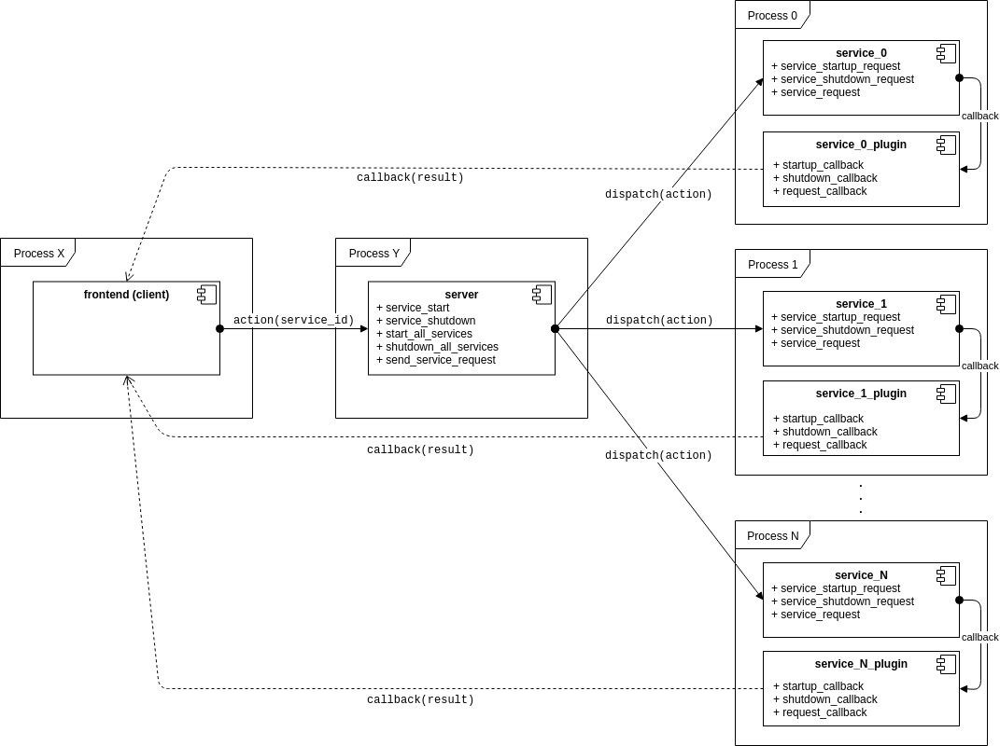

# Architecture

API tries to stay fairly trivial and straightforward without putting too much burden (impl. details) on the frontend side but there are couple of important bits and pieces that should be understood in order to efficiently use this API.

## Design
### Services
Aforementioned features are organized into [services](services).
Each [service](service.py):
* Is assigned its own unique ID
* Runs in its own context (process)
* Supports a set of common operations: `startup`, `shutdown`, `request`
* Provides a user-defined hook, so called [`plugin`](service_plugin.py), to be invoked on completion of any of the supported operations

### Server
Communication with any of the `service` is established/routed via proxy [`server`](server.py) which sits in between the client (frontend) and corresponding `service`. Server implements a very simple API:
* `start-all-services`
* `start-service`
* `shutdown-all-services`
* `shutdown-service`
* `send-service-request`

[Public API](api.py), which is exposed to clients, is implemented on top of `server` API.

### Async
API, due to the nature of features being implemented, is designed to work in an **asynchronous** fashion. That means that retrieving the result from corresponding operation cannot be done via regular (synchronous) return-value mechanism but instead one must register a hook (callback) object which will then be invoked once the result is ready (after operation has completed). These callbacks we call `plugin`s.

### Plugin
Plugin is a mechanism to subscribe for a result of an asynchronous operation. This is a customization go-to point for client code to decide what to do with the result (e.g. process it further and communicate it back to the frontend using the appropriate inter-process mechanism).

### Diagram

### Example usage

#### `cxxd` integration tests

[Integration test suite](tests/integration/test_all.py) is actually a representative example of a frontend which has a main purpose in validating the data computed by the services (e.g. if `go-to-definition` returns a valid/expected source code location). Some other frontends will rather like to do something more with the data, e.g. visualize it or populate the UI elements with it.

So, integration tests have all of the important bits which depict the usage of an API:

* We have to [start the server](tests/integration/test_all.py#L70-L80) before anything else.

* A mechanism which provides customization point for application-specific purposes is [factory function](tests/integration/test_all.py#L17-L26). Factory function will be invoked during the server startup phase. Its purpose is to provide a means to instantiate an application-specific server with main (customization) part being the [registration of application-specific plugins](tests/integration/test_all.py#L22-L25).

* Application-specific plugins in integration tests will only [make a copy](tests/integration/cxxd_plugins.py#L12) of received data to be able to [validate its contents](tests/integration/test_all.py#L114) from the test execution context.

* To communicate the received data to different execution contexts (processes), one shall use some form of inter-process communication mechanisms. This integration test suite implements the inter-process communication by utilizing the [shared-memory](tests/integration/cxxd_callbacks.py#L10) to store the data and [named-semaphores](tests/integration/cxxd_callbacks.py#L179) to synchronize between R/W accesses. Some other application will use other means to achieve the same (i.e. to communicate the data back to `vim` instance one could make use one of the [RPC mechanisms](http://vimdoc.sourceforge.net/htmldoc/remote.html) that `vim` provides).

* [Example](tests/integration/test_all.py#L112-114) of triggering the service is running the source code indexer on the given directory, waiting until it is completed and querying if it has run successfuly.

* Many other examples depicting the usage of an API

## Public API

### General `cxxd` server startup/shutdown API

| API | Return Value |
| ------------- |:-------------:|
| `server_start(get_server_instance, get_server_instance_args, project_root_directory, log_file)` | `handle` |
| `server_stop(handle, *payload)`| `status`, `payload` |
| `server_start_all_services(handle, *payload)` | `status`, `payload` |
| `server_stop_all_services(handle, *payload)` | `status`, `payload` |

----------------------------

### Source code model API

| API | Return Value |
| ------------- |:-------------:|
| `source_code_model_start(handle, compiler_args)` | `status`, `payload` |
| `source_code_model_stop(handle, subscribe_for_callback)` | `status`, `payload` |
| `source_code_model_semantic_syntax_highlight_request(handle, filename, contents)` | `status`, [`translation_unit_ast`, `ast_visitor_function`] |
| `source_code_model_diagnostics_request(handle, filename, contents)` | `status`, [`diagnostics_iterator`, `diagnostics_visitor_function`, `fixit_visitor_function`] |
| `source_code_model_type_deduction_request(handle, filename, contents, line, col)` | `status`, `type_spelling` |
| `source_code_model_go_to_definition_request(handle, filename, contents, line, col)` | `status`, [`definition_filename`, `definition_line`, `definition_column`] |
| `source_code_model_go_to_include_request(handle, filename, contents, line)` | `status`, `include_header_filename` |
| `source_code_model_indexer_run_on_single_file_request(handle, filename, contents)` | `status`, `None` |
| `source_code_model_indexer_run_on_directory_request(handle)` | `status`, `None` |
| `source_code_model_indexer_drop_single_file_request(handle, filename)` | `status`, `None` |
| `source_code_model_indexer_drop_all_request(handle, remove_db_from_disk)` | `status`, `None` |
| `source_code_model_indexer_drop_all_and_run_on_directory_request(handle)` | `status`, `None` |
| `source_code_model_indexer_find_all_references_request(handle, filename, line, col)` | `status`, list_of_references(`filename`, `line`, `column`, `context`) |
| `source_code_model_indexer_fetch_all_diagnostics_request(handle, sorting_strategy)` | `status`, list_of_diagnostics(`filename`, `line`, `column`, `description`, `severity`) |

----------------------------

### Project Builder API

| API | Return Value |
| ------------- |:-------------:|
| `project_builder_start(handle)` | `status`, `payload` |
| `project_builder_stop(handle, subscribe_for_callback)` | `status`, `payload` |
| `project_builder_request(handle, build_command)` | `status`, [`build_cmd_output_filename`, `build_exit_code`, `duration`] |

----------------------------

### Clang-format API

| API | Return Value |
| ------------- |:-------------:|
| `clang_format_start(handle)` | `status`, `payload` |
| `clang_format_stop(handle, subscribe_for_callback)` | `status`, `payload` |
| `clang_format_request(handle, filename)` | `status`, `None` |

----------------------------

### Clang-tidy API

| API | Return Value |
| ------------- |:-------------:|
| `clang_tidy_start(handle, json_compilation_database)` | `status`, `payload` |
| `clang_tidy_stop(handle, subscribe_for_callback)` | `status`, `payload` |
| `clang_tidy_request(handle, filename, apply_fixes)` | `status`, `clang_tidy_output_filename` |